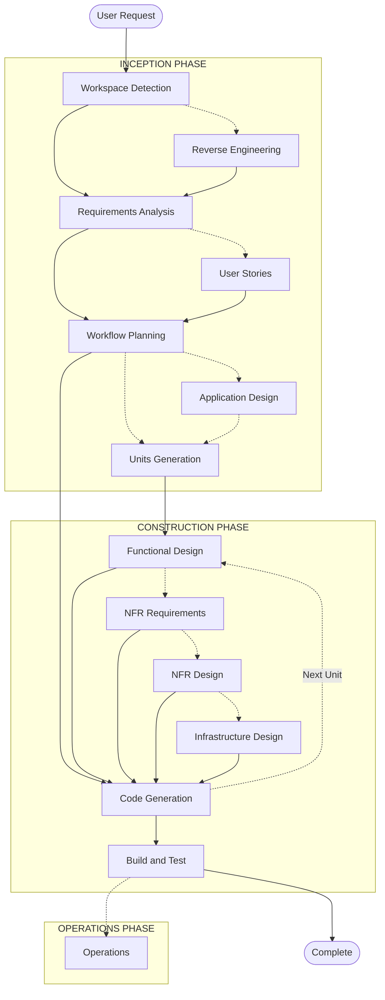

# AI-DLC Workflow Dependencies

Stage dependency graph. Solid arrows = always flows. Dashed arrows = conditional flows.

## User's Role

- Answer questions in dedicated files using `[Answer]:` tags with letter choices
- Review and approve each stage's completion message before proceeding
- Option X (Other) is always available for custom responses
